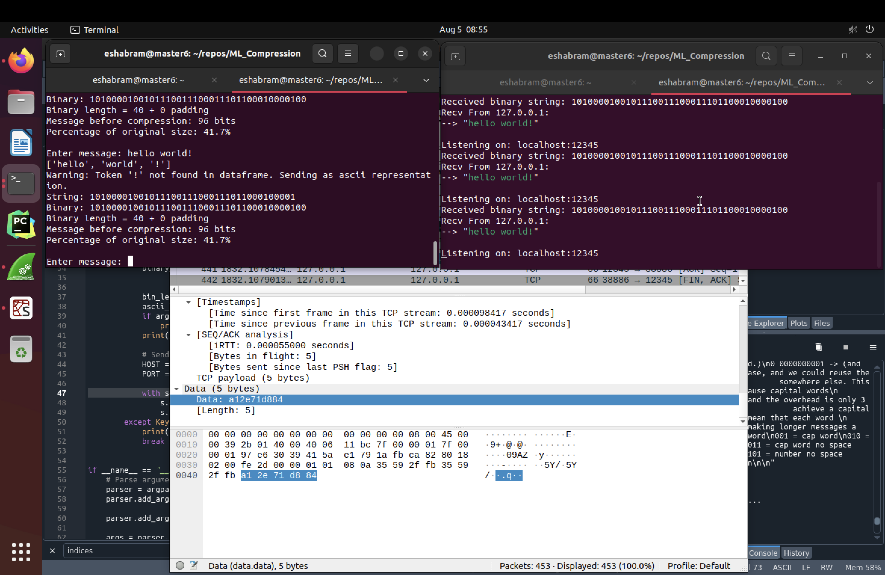

### Basic instructions:

if the dependencies and libraries necessary are installed (you'll likely need nltk and anaconda') then you
should be good to begin.

Open two linux termial and run client.py and server.py on the other like this:

```
python3 client.py -v
```

and from the other shell

```
python3 server.py -v

```

The -v is for verbose mode, which gives more information. 

Advanced mode is also available, which gives a perfect (lossless?) representation of the message, particularly 
when you give it a file like this:

```
python3 client -a -f <file name>
``` 
and 
```
python3 client -a
```

That's it. If you'd like to verify that the data is the size specified, you can run wireshark and capture one 
the TCP packets and find the "payload" or "data". Have fun!
