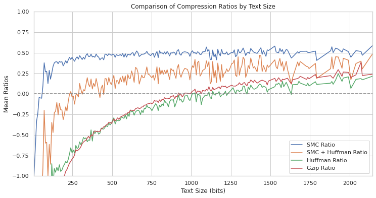

# SMC Compression:

Short Message Coding (SMC) is a lossless compression algorithm designed 
specifically for messaging with real-time compression in mind. Conventional compression 
algorithms typically lack the ability to compress short text due to the inclusion
of translation keys and reliance on repetative characters.
SMC works similarly to Huffman coding, in that the goal is to assign the 
shortest codes to the most common entries, but rather than assigning codes based 
on character, SMC uses a small database of words ranked by commonality. This 
method is beneficial because it removes the need for translation keys to be sent
with the messages. The use of hashmaps for both encoding and decoding makes this
implementation quite fast. In general, the philosophy behind this compression 
algorith is *space-time tradeoff*, but even with the added word commonality 
dataset, this project isn't more than a few megabytes in size. That is an 
increasingly small price to pay in the Age of Information. 

Below is a figure showing compression ratios for different algorithms in short message 
scenarios such as sms. The human conversation dataset referenced
at the bottom of this readme was used in running tests for the collecting of this
data. The plot illustrates SMC effectiveness for short messages. Note that below 
the dashed line represents a negative compression ratio, meaning that the messages
actually get larger.



The very right of the plot represents the bit equivalent to 280 characters, which
was puposely chosen for its familiarity, being that 280 was the character limit 
for twitter posts from 2017 until recently. Before 2017 it was half that length.
Above that range would be fairly uncommon for sms type messaging. 

---
### Dependencies:

The best way to ensure that dependencies are met is to use Anaconda. This will 
ensure that most of the tools needed are there. To do this, navigate to the 
Anaconda website located [Anaconda](https://www.anaconda.com/download "HERE") 
and download the operating specific version. The only dependency outside of this
would be nltk for word tokenization and various other text processing. Run this 
command to install:

```
conda install nltk
```

That should do it.

### Using the client and server with compression:

Open two linux termial and run client.py on one, and server.py on the other like this:

```
python3 client.py -v
```

and from the other shell

```
python3 server.py -v
```

This will will send a message using the lossless SMC compression designed for 
use with short text messaging in mind. 

```
python3 client.py -f <file name>
``` 
If your server.py is already running in the default mode, then you do not need to 
rerun the script. It will read it in just fine. 

---
### Compressing files with SMC:

There is also an option to use SMC to compress and decompress files.
To compress a file with SMC simply run SMC.py located in the main directory as such:

```
python3 SMC.py <file path>
```

This will create a file in the same directory as the file being compressed with 
the same name, but ending in the .smc file extension. That extension will be 
necessary to run the decode, though there is a --force option for convenience.
Run the decompressor as such:

```
python3 SMC.py -d <.smc file path>
``` 

The -d flag specifies --decompression, which makes sure that the file is a .smc 
file unless the --force argument is used. This command will generate a .uncompressed
version of the .smc file with the same name and location.

NOTE: Since SMC was designed for short messages, it is not ideal for large file
compression, but with the includion of a simple huffman scheme, it does okay against
other compression algorithms such as gzip. In general, gzip beats the heck out of
SMC for file compression, but there is plenty of room for optimization, and perhaps 
this can be expanded upon in further research.  

---
### Lossy mode:

Running both client and server script with the -l flag will initiate the 
--lossy mode, which is designed specifically with radio communication in mind. 
This separate algorithm gives the smallest compression while still retaining
the messages meaning (lossy). This algorithm currently averages around 3:1 
compression. This mode can be useful for low baud rate situation, and/or 
emergency communication. 

---
### Recreating data:

If you would like to recreate the experiments and generate new data, simply run
the process_data.py like so:

```
python2 process_data.py -t
```

This will generate a file in the data/ folder named 'log.csv' containing Information
for tests run on each line of the human conversation dataset. You can run the script
again without the -t flag to generate the plot at the top of this readme.

---

That's it. If you'd like to verify that the data is the size specified, you can 
run wireshark and capture one of the TCP packets and find the "payload" or "data", 
or you can compress a file using SMC.py. 
Have fun!


Data for word frequencey retrieved from:
https://www.kaggle.com/datasets/rtatman/english-word-frequency?resource=download

Human conversation dataset used for testing retrieved from:
https://www.kaggle.com/datasets/projjal1/human-conversation-training-data


